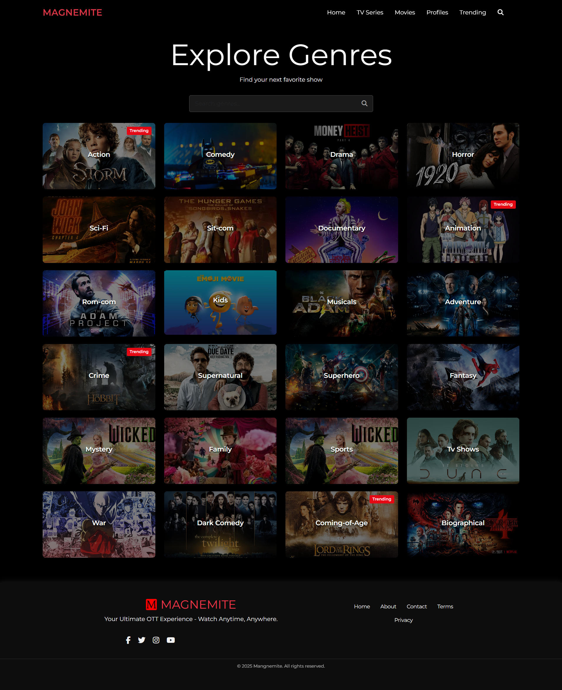
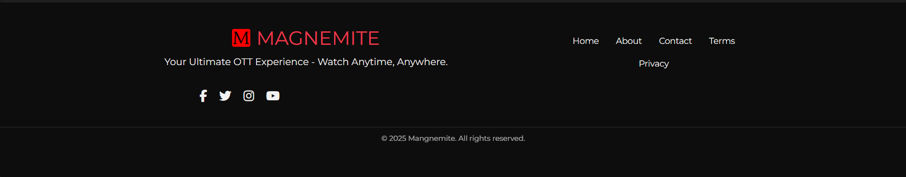
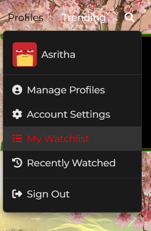
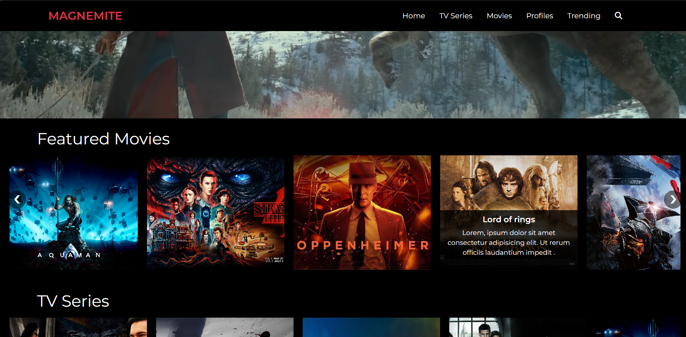
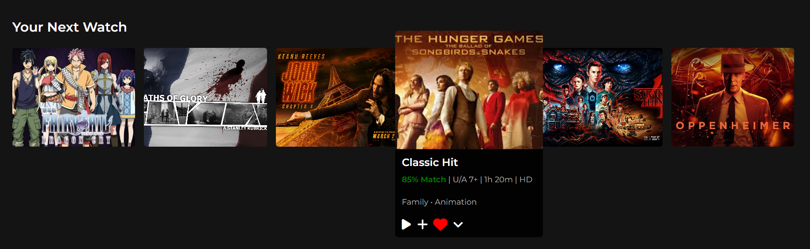
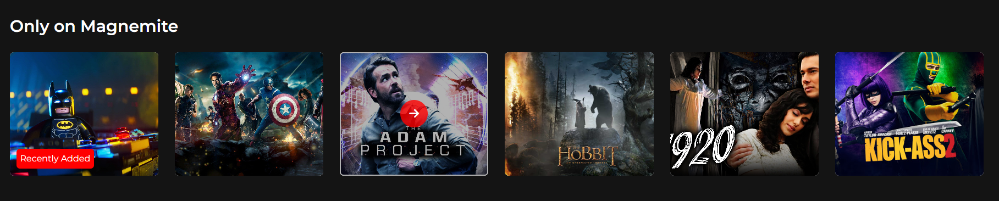
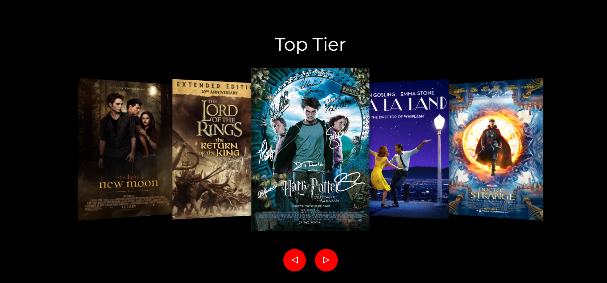
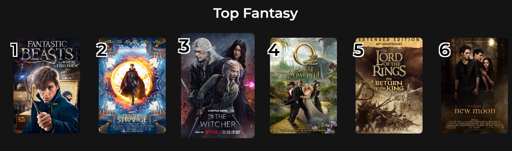
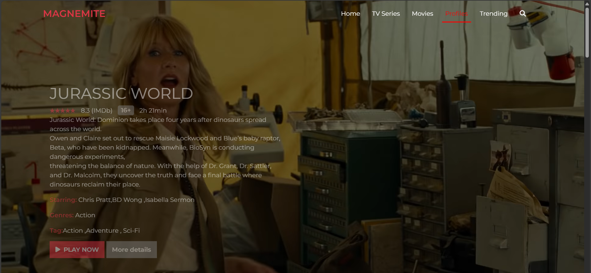

# Ott-Application-Magnamite-
"🎬 Magnamite – self-built OTT platform built with HTML, CSS, JS &amp; Bootstrap."
# 🎬🔥 Magnamite OTT Platform – Project Showcase 🚀💻  

🎥 **Magnamite** is a **next-gen OTT platform** I designed and developed to deliver a sleek, immersive streaming experience.  
It features a **cinematic dark-themed interface**, smooth navigation, and responsive design—built with **modern web technologies** to create a **seamless user experience**. 💻✨  

✅ **Fun Fact:**  
I named **Magnamite** after my **childhood favorite anime, Pokémon**. Though it has no specific meaning, it reflects my **nostalgic and creative touch**, giving the platform a **unique identity**. 🐾⚡  

---

## 🚀✨ **Project Overview**  
Magnamite offers a **visually captivating and fully responsive** OTT experience with:  
- 🔥 **Intuitive navigation** and smooth transitions.  
- 🖥️ **Seamless responsiveness** across all devices.  
- 🎯 **Dynamic interactivity** for enhanced user engagement.  

🔧 **Tech Stack:**  
- 💻 **HTML5:** Structured the layout.  
- 🎨 **CSS3:** Styled the interface and animations.  
- ⚙️ **JavaScript:** Added dynamic interactivity.  
- 🚀 **Bootstrap:** Ensured a mobile-friendly, responsive design.  

---

## 🎯🔥 **Key Features**  

✅ 🎨 **Sleek, Dark-Themed UI:**  
- I created a **cinematic black backdrop** with a stylish gradient banner.  
- Added **clean typography and subtle hover effects** for a polished look.  

✅ 🖥️ **Fully Responsive Design:**  
- The platform **adapts flawlessly** to desktops, tablets, and smartphones.  
- I used **Bootstrap’s grid system** for flexibility and consistency.  

✅ 🌐 **Smooth Navigation:**  
- I designed a **clean navbar** for easy navigation.  
- Added **CTA buttons** with hover and click effects to boost interactivity.  

✅ 🎬 **Dynamic Banner Section:**  
- Eye-catching **gradient CTA banner** for a premium feel.  
- JavaScript-powered **on-click interactivity** for a smooth UX.  

✅ 🎥 **Custom Animations:**  
- I implemented **CSS animations** for smooth transitions and hover effects.  
- This enhances the **overall visual appeal and user experience**.  

✅ 🛠️ **Console Logging for Debugging:**  
- I used **console logs** during development to test and optimize functionality.  

---

## 📸🔥 **Screenshots – Visual Showcase**  

### 🖥️ **Home Page**  
  

🔥 **Details:**  
- Captivating **landing page** with a sleek hero section.  
- **CTA buttons** with hover effects for improved user interaction.  

### 🔥 **Trending Section**  
  
🔥 **Details:**  
- Displaying the **most popular shows and movies**.  
- Clean, consistent card layout with hover effects.  

### 🎯 **Genre Section**  
  
🔥 **Details:**  
- Filter content by **categories and genres**.  
- Hover animations and smooth transitions.  

### 🎬 **Movie Info Section**  
  
🔥 **Details:**  
- Detailed **movie descriptions** with thumbnails.  
- Movie metadata, rating, and interactive buttons.  

### 🌐 **Navbar**  
  
🔥 **Details:**  
- Clean, **responsive navbar** with smooth scrolling.  
- Easy access to all sections.  

### 🔥 **Footer Section**  
  
🔥 **Details:**  
- Footer with **social media links** and contact info.  
- Consistent design across all pages.  

### 👤 **Profiles Section**  
  
🔥 **Details:**  
- **User profile cards** with hover animations.  
- Dynamic styling and interactive elements.  

### 🔥 **Scroll Content Section**  
  
🔥 **Details:**  
- Smooth **scrolling effect** for content showcase.  
- Enhances the **user browsing experience**.  

### 🎯 **Next Watch Section**  
  
🔥 **Details:**  
- Recommendations for **upcoming watchlist**.  
- Clean, visually appealing layout.  

### 🎥 **Only on Magnamite Section**  
  
🔥 **Details:**  
- Exclusive content section.  
- **Highlighted thumbnails** with hover effects.  

### 🔥 **Top Tier Section**  
  
🔥 **Details:**  
- Premium content section.  
- Smooth navigation and transitions.  

### 🎬 **Top Fantasy Section**  
  
🔥 **Details:**  
- Genre-specific selection of **fantasy content**.  
- **Hover animations** for interactive browsing.  

### 🌟 **Hero Section**  
  
🔥 **Details:**  
- Eye-catching **hero banner** with CTA.  
- Smooth transitions and interactive elements.  

---

## 💡⚙️ **Challenges & Solutions**  

🔥 **Challenge 1: Mobile Responsiveness**  
- 🚫 **Issue:** Layout inconsistencies on smaller screens.  
- ✅ **Solution:** I applied **Bootstrap classes and media queries** to ensure a consistent, flexible layout.  

🔥 **Challenge 2: Smooth Navigation Transitions**  
- 🚫 **Issue:** Abrupt navigation changes.  
- ✅ **Solution:** I added **CSS hover effects and smooth transitions** for a seamless browsing experience.  

🔥 **Challenge 3: Optimizing Animations**  
- 🚫 **Issue:** Ensuring **consistent performance** across devices.  
- ✅ **Solution:** I used **lightweight animations** to maintain smooth rendering.  

## 🚀🔧 **Future Enhancements**  
🔧 **Enhanced Interactivity:**  
- 🔥 I plan to add **content carousels** with hover animations.  
- 🎥 Implement **movie cards** with flip effects.  

⚙️ **Backend Integration:**  
- 🔑 Add **user authentication** and personalized watchlists.  
- 🌐 Integrate APIs to **fetch dynamic movie data**.  

🎯 **SEO Optimization:**  
- ⚙️ Add **meta tags, alt attributes, and structured data** to boost search visibility.  

---

## ✨🔥 **Key Takeaway**  
Building **Magnamite** was a rewarding experience that **strengthened my skills** in **HTML, CSS, JavaScript, and Bootstrap**.  
I’m proud of the **polished design, smooth functionality, and seamless responsiveness**. 💻🔥  

---

   
 
